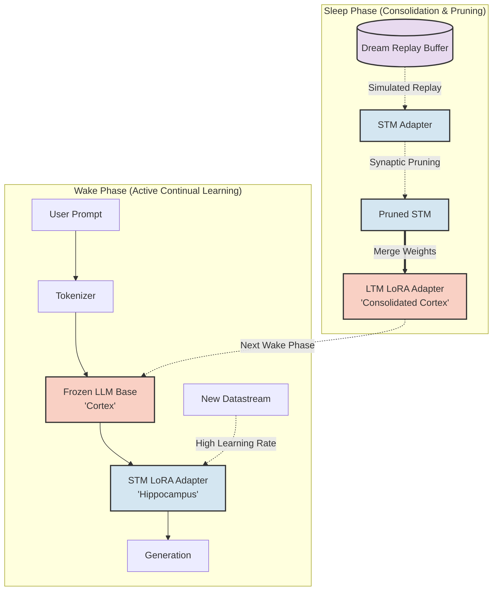
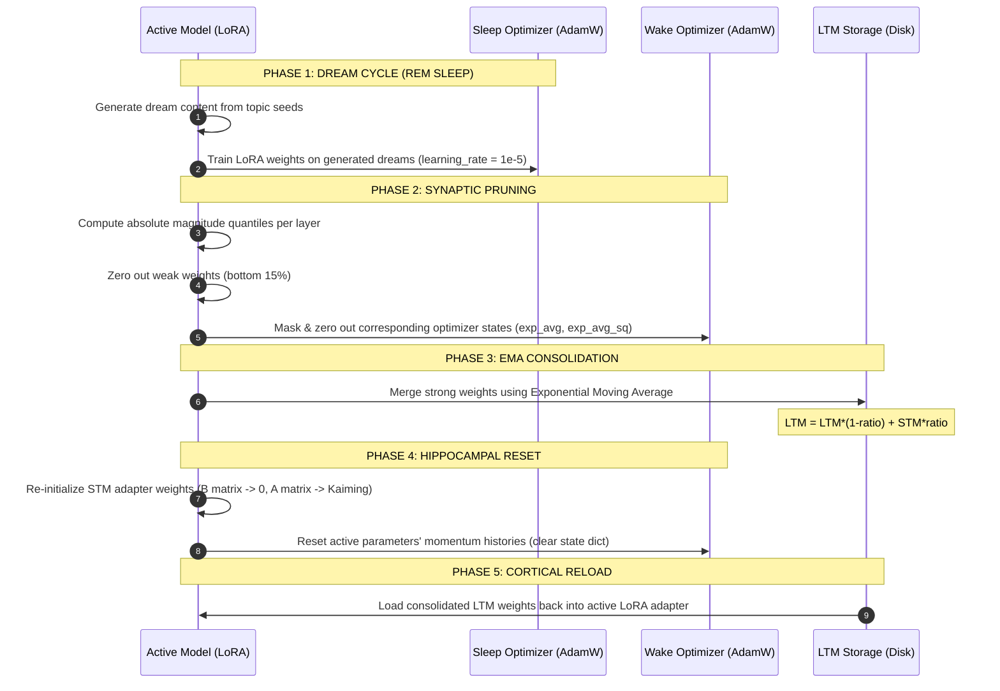

# LivingLLM Architecture

This document tracks the system architecture of the Synaptic Consolidation LLM, highlighting both the conceptual flow and the practical implementation details based on the latest codebase audit.

---

## 1. Dual-Memory Concept

The architecture splits learning into a high-plasticity **Hippocampus** (STM Adapter) and a stable **Cortex** (Base Model + LTM checkpoint), coordinated via wake/sleep cycles.

---

## 2. Actual Sleep Phase Implementation Mechanics

The sleep cycle is implemented as a sequential pipeline in `src/sleep.py` and `src/memory.py`. To prevent memory leaks and catastrophic parameter state corruption, several critical safeguards are integrated into the pipeline:

---

## 3. Architectural Audit Findings

Following a systematic audit of the draft codebase, several architectural limits and vulnerabilities were mapped:

### 3.1 The Momentum Resurrection Vulnerability
* **The Issue:** When weights are pruned (zeroed), PyTorch optimizers like AdamW still retain momentum values (`exp_avg` and `exp_avg_sq`) for those weight coordinates. In the next training step, non-zero momentum values immediately reconstruct the "pruned" weights.
* **The Fix:** The pruning phase must explicitly zero out the optimizer state slices corresponding to the masked weights. Furthermore, resetting the STM adapter requires a complete state reset for the wake optimizer to prevent stale gradient history from leaking into the next wake phase.

### 3.2 Sleep Cycle Semantic Drift
* **The Issue:** Currently, the model "dreams" by generating text based on prompts and then training on its own generated output. This creates a positive feedback loop reinforcing the model's own hallucinations and noise, leading to semantic drift.
* **The Solution (Planned):** Introduce a frozen baseline reference model during sleep. Dreams are generated by the frozen copy, and the active model is optimized using a combined loss:
  $$\mathcal{L} = \mathcal{L}_{\text{replay}} + \alpha D_{\text{KL}}(P_{\text{frozen}} \parallel P_{\text{live}})$$

### 3.3 Lossy EMA Transfer
* **The Issue:** With a small consolidation ratio (e.g., $0.1$), resetting the STM adapter immediately after merging means that $90\%$ of recent, unconsolidated wake-state learning is wiped out. Memories must be reinforced across multiple sleep cycles to remain stable in LTM.
