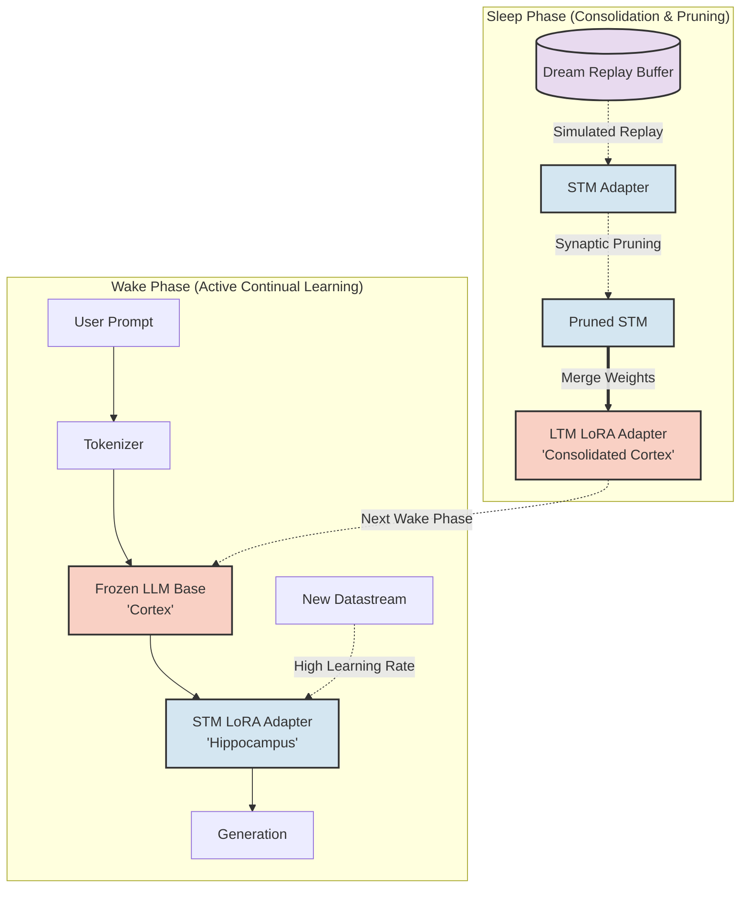
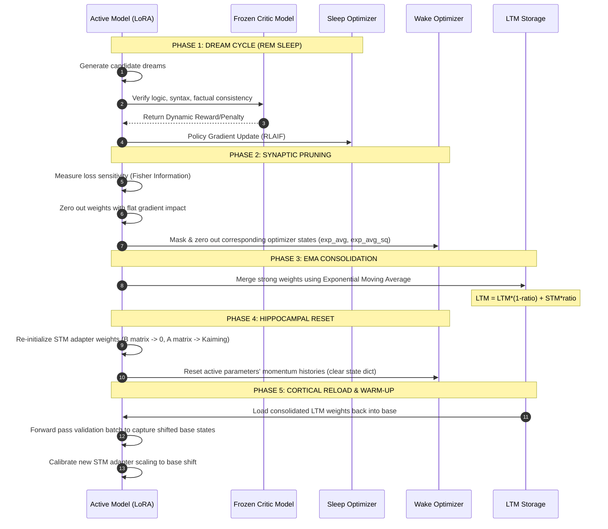

# LivingLLM Architecture

This document tracks the system architecture of the Synaptic Consolidation LLM, highlighting both the conceptual flow and the practical implementation details based on the latest codebase audit.

---

## 1. Dual-Memory Concept

The architecture splits learning into a high-plasticity **Hippocampus** (STM Adapter) and a stable **Cortex** (Base Model + LTM checkpoint), coordinated via wake/sleep cycles.

---

## 2. Actual Sleep Phase Implementation Mechanics

The sleep cycle is implemented as a sequential pipeline in `src/sleep.py` and `src/memory.py`. To prevent memory leaks, catastrophic forgetting, and hallucination loops, the pipeline incorporates self-critique and sensitivity-aware pruning:

---

## 3. Architectural Audit Findings

Following a systematic audit of the theoretical and practical limits of the design, several fatal bottlenecks were identified and resolved:

### 3.1 The Real-Time Parallelization Bottleneck
* **The Issue:** Standard backpropagation is strictly sequential. Running a forward pass, computing loss, and running a backward pass directly inside a live chat inference loop will absolutely nuke token-per-second generation speeds. GPUs are built for massive parallel matrix math, not step-by-step sequential gradient updates mid-generation.
* **The Fix:** Live continual learning must be decoupled from the primary inference thread. Gradients must be accumulated asynchronously or processed via delayed micro-batches so inference latency isn't bottlenecked by the backward pass.

### 3.2 The Hallucination Amplification Loop (Semantic Drift)
* **The Issue:** Dreaming by simply generating text and training on it creates a closed-loop system where the model actively optimizes for its own mistakes. Minor bad habits get permanently burned into the LTM core via the EMA merge.
* **The Fix:** Implement a Generative Verifier Loop (RLAIF) during sleep. A secondary frozen critic evaluates candidate dreams for loops, typos, and contradictions. The active STM is updated via Policy Gradient only on verified, high-quality dreams.

### 3.3 Over-Pruning Essential Structural Subspaces
* **The Issue:** A flat absolute magnitude quantile pruning rule assumes small weights ($W \approx 0.002$) are useless. In reality, these tiny weights often control vital structural triggers (like closing brackets or punctuation). Uniform pruning lobotomizes core grammar rules.
* **The Fix:** Swap magnitude pruning for **Fisher Information Pruning**. Measure the sensitivity of the loss function relative to each weight. Prune only weights with a flat gradient impact, preserving tiny weights that would otherwise cause a massive spike in loss if zeroed.

### 3.4 The Weight-Decay Alignment Shift (LTM/STM Disconnect)
* **The Issue:** Re-initializing the STM adapter (B→0, A→Kaiming) while the base model has shifted from the overnight LTM merge causes a massive Activation Distribution Shift. The STM spends the first few hours of the wake cycle outputting garbled text trying to recalibrate to the new base weights.
* **The Fix:** Introduce a brief **Warm-up Phase** upon waking. Pass a generic validation batch through the newly merged LTM core, capture hidden states, and calibrate the initialization scaling factor of the new STM adapter matrices before taking user prompts.

### 3.5 The Momentum Resurrection Vulnerability
* **The Issue:** When weights are pruned (zeroed), PyTorch optimizers like AdamW still retain momentum values (`exp_avg` and `exp_avg_sq`). In the next training step, non-zero momentum values immediately reconstruct the "pruned" weights.
* **The Fix:** Explicitly zero out the optimizer state slices corresponding to the masked weights during pruning. Furthermore, reset the STM adapter's state dictionary entirely upon waking.
